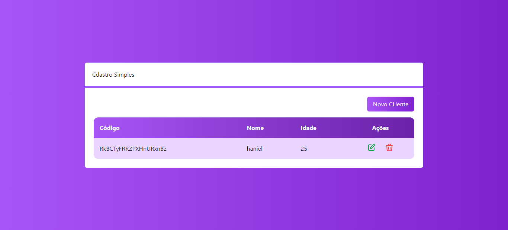
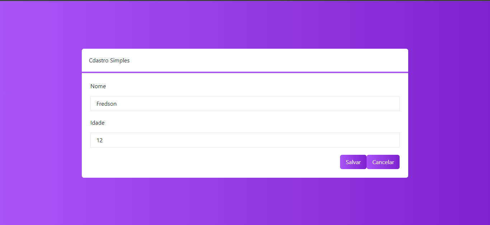

### Project Register Clients in System

This projet is a CRUD basic using REACT,NEXT JS and TYSCRIPT with FIREBASE. Here is possible register clients, delete clients and alter data of a client. 

## Execute Project

```bash
npm run dev 
``` 

or version for production


```bash
npm start
``` 
 Open [http://localhost:3000](http://localhost:3000) with your browser to see the result.


## Screens







